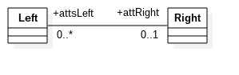

A continuación se muestran ejemplos de cómo se deberían anotar dos entidades relacionadas entre sí según el tipo de relación entre ellas. Para este ejemplo se suponen dos entidades llamadas `Left` (Izquierda) y `Derecha`. También se muestra la vista de estas entidades y su relación en UML y en un modelo de datos físico.

## Relaciones con JPA

### Relaciones Unidireccionales

#### Uno a Uno Unidireccional

##### UML


##### Modelo de Datos


*Llaves Foráneas*:   
- De la tabla `lefts` a la tabla `rights`: `fk_lefts.att_right_id_rights.id`


##### Java (POJO)
```java
    @Entity
    @Table(name = "lefts")
    public class Left implements Serializable {
        private static final long serialVersionUID = 1L;

        @Id
        @GeneratedValue(strategy = GenerationType.IDENTITY)
        @Column(name = "id", unique = true, nullable = false)
        private Long id;

        @OneToOne
        @JoinColumn(name = "att_right_id", unique = true)
        private Right attRight;

        public Long getId() {
            return id;
        }

        public void setId(Long id) {
        this.id = id;
        }

        public Right getAttRight() {
            return attRight;
        }

        public void setAttRight(Right attRight) {
            this.attRight = attRight;
        }

    }
```
```java
    @Entity
    @Table(name = "rights")
    public class Right implements Serializable {
        private static final long serialVersionUID = 1L;

        @Id
        @GeneratedValue(strategy = GenerationType.IDENTITY)
        @Column(name = "id", unique = true, nullable = false)
        private Long id;

        public Long getId() {
            return id;
        }

        public void setId(Long id) {
        this.id = id;
        }

    }
```


#### Uno a Muchos Unidireccional

#### UML


!No soportada!  
En este tipo de relación, la entidad `Left` debe ser siempre navegable desde la entidad `Right`.  
Este caso sería el **mismo que la relación Bidireccional Uno a Muchos**  

#### Muchos a Uno Unidireccional

##### UML


##### Modelo de Datos


*Llaves Foráneas*:   
- De la tabla `lefts` a la tabla `rights`: `fk_lefts.att_right_id_rights.id`

#### Java (POJO)
```java
    @Entity
    @Table(name = "lefts")
    public class Left implements Serializable {
        private static final long serialVersionUID = 1L;

        @Id
        @GeneratedValue(strategy = GenerationType.IDENTITY)
        @Column(name = "id", unique = true, nullable = false)
        private Long id;

        @ManyToOne
        @JoinColumn(name = "att_right_id")
        private Right attRight;

        public Long getId() {
            return id;
        }

        public void setId(Long id) {
        this.id = id;
        }

        public Right getAttRight() {
            return attRight;
        }

        public void setAttRight(Right attRight) {
            this.attRight = attRight;
        }

    }
```
```java
    @Entity
    @Table(name = "rights")
    public class Right implements Serializable {
        private static final long serialVersionUID = 1L;

        @Id
        @GeneratedValue(strategy = GenerationType.IDENTITY)
        @Column(name = "id", unique = true, nullable = false)
        private Long id;

        public Long getId() {
            return id;
        }

        public void setId(Long id) {
        this.id = id;
        }

    }
```
#### Muchos a Muchos Unidireccional

#### UML


#### Data Model


*Llaves Foráneas*:   
- De la tabla `lefts_atts_right` a la tabla `lefts`:  `fk_lefts_atts_right.left_id_lefts.id`
- De la tabla `lefts_atts_right` a la tabla `rights`: `fk_lefts_atts_right.att_right_id.rights.id`

#### Java (POJO)
```java
    @Entity
    @Table(name = "lefts")
    public class Left implements Serializable {
        private static final long serialVersionUID = 1L;

        @Id
        @GeneratedValue(strategy = GenerationType.IDENTITY)
        @Column(name = "id", unique = true, nullable = false)
        private Long id;

        @ManyToMany
        @JoinTable(name = "lefts_atts_right", 
        joinColumns = JoinColumn(name="left_id", referencedColumnName="id"),
        inverseJoinColumns = 
        @JoinColumn(name="att_right_id", referencedColumnName="id"))
        private Set<Right> attsRight = new HashSet<>();

        public Long getId() {
            return id;
        }

        public void setId(Long id) {
        this.id = id;
        }

        public Set<Right> getAttsRight() {
            return attsRight;
        }

        public void setAttsRight(Set<Right> attsRight) {
            this.attsRight = attsRight;
        }

        public Left addAttRight (Right attsRight) {
            this.attsRight.add(attsRight);
            attsRight.getLeft().add(this);
            return this;
        }

        public Left removeAttRight(Right attsRight) {
            this.attsRight.remove(attsRight);
            attsRight.getLeft().remove(this);
            return this;
        } 

    }
```
```java
    @Entity
    @Table(name = "rights")
    public class Right implements Serializable {
        private static final long serialVersionUID = 1L;

        @Id
        @GeneratedValue(strategy = GenerationType.IDENTITY)
        @Column(name = "id", unique = true, nullable = false)
        private Long id;

        public Long getId() {
            return id;
        }

        public void setId(Long id) {
            this.id = id;
        } 

    }
```

## Relaciones Bidireccionales

### Uno a Uno Bidireccional

#### UML


#### Data Model


*LLaves Foráneas*:   
- De la tabla `lefts` a la tabla `rights`: `fk_lefts.att_right_id_rights.id`

#### Java (POJO)
```java
    @Entity
    @Table(name = "lefts")
    public class Left implements Serializable {
        private static final long serialVersionUID = 1L;

        @Id
        @GeneratedValue(strategy = GenerationType.IDENTITY)
        @Column(name = "id", unique = true, nullable = false)
        private Long id;

        @OneToOne
        @JoinColumn(name = "att_right_id", unique = true)
        private Right attRight;

        public Long getId() {
            return id;
        }

        public void setId(Long id) {
        this.id = id;
        }

        public Right getAttRight() {
            return attRight;
        }

        public void setAttRight(Right attRight) {
            this.attRight = attRight;
        }

    }
```
```java
    @Entity
    @Table(name = "rights")
    public class Right implements Serializable {
        private static final long serialVersionUID = 1L;

        @Id
        @GeneratedValue(strategy = GenerationType.IDENTITY)
        @Column(name = "id", unique = true, nullable = false)
        private Long id;

        @OneToOne(mappedBy = "attRight")
        private Left attLeft;

        public Long getId() {
            return id;
        }

        public void setId(Long id) {
        this.id = id;
        }    
        
        public Left getAttLeft() {
            return attLeft;
        }

        public void setAttLeft(Left attLeft) {
            this.attLeft = attLeft;
        }

    }
```
### Uno a Muchos Bidireccional

#### UML


#### Modelo de Datos


*Llaves Foráneas*:   
- De la tabla `rights` a la tabla `lefts`: `fk_rights.att_left_id_lefts.id`

#### Java (POJO)
```java
    @Entity
    @Table(name = "lefts")
    public class Left implements Serializable {
        private static final long serialVersionUID = 1L;

        @Id
        @GeneratedValue(strategy = GenerationType.IDENTITY)
        @Column(name = "id", unique = true, nullable = false)
        private Long id;

        @OneToMany(mappedBy = "attLeft")
        @JsonIgnore
        private Set<Right> attsRight = new HashSet<>();

        public Long getId() {
            return id;
        }

        public void setId(Long id) {
        this.id = id;
        }

        public Set<Right> getAttsRight() {
            return attsRight;
        }

        public void setAttsRight(Set<Right> attsRight) {
            this.attsRight = attsRight;
        }

        public Left addAttRight (Right attRight) {
            this.attsRight.add(attRight);
            attRight.getLeft().add(this);
            return this;
        }

        public Left removeAttRight(Right attRight) {
            this.attsRight.remove(attRight);
            attRight.getLeft().remove(this);
            return this;
        } 

    }
```
```java
    @Entity
    @Table(name = "rights")
    public class Right implements Serializable {
        private static final long serialVersionUID = 1L;

        @Id
        @GeneratedValue(strategy = GenerationType.IDENTITY)
        @Column(name = "id", unique = true, nullable = false)
        private Long id;

        @ManyToOne
        @JoinColumn(name = "att_left_id")
        private Left attLeft;

        public Long getId() {
            return id;
        }

        public void setId(Long id) {
        this.id = id;
        }    
        
        public Left getAttLeft() {
            return attLeft;
        }

        public void setAttLeft(Left attLeft) {
            this.attLeft = attLeft;
        }

    }
```
### Muchos a Uno Bidireccional

#### UML


#### Modelo de Datos


*Llaves Foráneas*:   
- De la tabla `lefts` a la tabla `rights`: `fk_lefts.att_right_id_rights.id`

#### Java (POJO)
```java
    @Entity
    @Table(name = "lefts")
    public class Left implements Serializable {
        private static final long serialVersionUID = 1L;

        @Id
        @GeneratedValue(strategy = GenerationType.IDENTITY)
        @Column(name = "id", unique = true, nullable = false)
        private Long id;

        @ManyToOne
        @JoinColumn(name = "att_right_id")
        private Right attRight;

        public Long getId() {
            return id;
        }

        public void setId(Long id) {
        this.id = id;
        }

        public Right getAttRight() {
            return attRight;
        }

        public void setAttRight(Right attRight) {
            this.attRight = attRight;
        }

    }
```
```java
    @Entity
    @Table(name = "rights")
    public class Right implements Serializable {
        private static final long serialVersionUID = 1L;

        @Id
        @GeneratedValue(strategy = GenerationType.IDENTITY)
        @Column(name = "id", unique = true, nullable = false)
        private Long id;

        @OneToMany(mappedBy = "attRight")
        private Set<Left> attsLeft = new HashSet<>();

        public Long getId() {
            return id;
        }

        public void setId(Long id) {
        this.id = id;
        }	    
        
        public Set<Left> getAttsLeft() {
            return attsLeft;
        }

        public void setAttsLeft(Set<Left> attsLeft) {
            this.attsLeft = attsLeft;
        }

    }
```
### Muchos a Muchos Bidireccional

#### UML


#### Modelo de Datos


*Llaves Foráneas*:   
- De la tabla `atts_left_atts_right` a la tabla `lefts`:  `fk_atts_left_atts_right.att_left_id_lefts.id`
- De la tabla `atts_left_atts_right` a la tabla `rights`: `fk_atts_left_atts_right.att_right_id.rights.id`

#### Java (POJO)
```java
    @Entity
    @Table(name = "lefts")
    public class Left implements Serializable {
        private static final long serialVersionUID = 1L;

        @Id
        @GeneratedValue(strategy = GenerationType.IDENTITY)
        @Column(name = "id", unique = true, nullable = false)
        private Long id;

        @ManyToMany
        @JoinTable(name = "atts_left_atts_right", 
        joinColumns = JoinColumn(name="att_left_id", referencedColumnName="id"),
        inverseJoinColumns = 
        @JoinColumn(name="att_right_id", referencedColumnName="id"))
        private Set<Right> attsRight = new HashSet<>();

        public Long getId() {
            return id;
        }

        public void setId(Long id) {
        this.id = id;
        }

        public Set<Right> getAttsRight() {
            return attsRight;
        }

        public void setAttsRight(Set<Right> attsRight) {
            this.attsRight = attsRight;
        }

        public Left addAttRight (Right attsRight) {
            this.attsRight.add(attsRight);
            attsRight.getLeft().add(this);
            return this;
        }

        public Left removeAttRight(Right attsRight) {
            this.attsRight.remove(attsRight);
            attsRight.getLeft().remove(this);
            return this;
        } 

    }
```
```java
    @Entity
    @Table(name = "rights")
    public class Right implements Serializable {
        private static final long serialVersionUID = 1L;

        @Id
        @GeneratedValue(strategy = GenerationType.IDENTITY)
        @Column(name = "id", unique = true, nullable = false)
        private Long id;

        @ManyToMany(mappedBy = "attsRight")
        @JsonIgnore
        private Set<Left> attsLeft = new HashSet<>();

        public Long getId() {
            return id;
        }

        public void setId(Long id) {
        this.id = id;
        }

        public Set<Left> getLefts() {
            return attsLeft;
        }

        public void setLefts(Set<Left> attsLeft) {
            this.attsLeft = attsLeft;
        }

        public Right addLeft(Left left) {
            this.attsLeft.add(left);
            left.getAttsRight().add(this);
            return this;
        }

        public Right removeLeft(Lefts left) {
            this.lefts.remove(left);
            lefts.getAttsRight().remove(this);
            return this;
        }  

    }
```